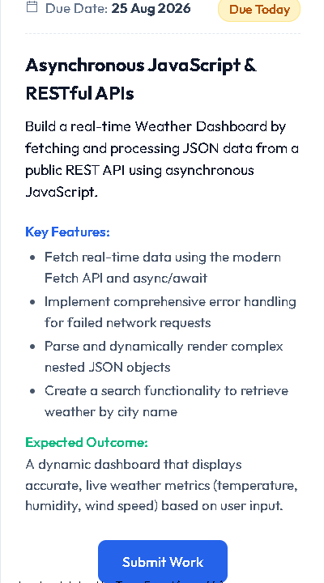

# SkyPulse — Modern Real-Time Weather Dashboard

**Created By Sypradip Bhattacharjee**

A sleek, responsive, and feature-packed Weather Dashboard built with **Vanilla HTML5, CSS3 (Modern Glassmorphism & Custom Properties), and Asynchronous JavaScript (ES6+ / Fetch API / Async-Await)**.



---

## 🌟 Key Features

### 1. Asynchronous JavaScript & RESTful APIs
- **Modern Fetch API & `async`/`await`**: Clean, non-blocking asynchronous calls to retrieve real-time meteorological data.
- **AbortController Timeouts**: Handles slow or hanging connections with automatic 8-second request timeouts.
- **Open-Meteo REST API**: Zero-config setup (no API key required) for instant worldwide weather data.
- **Open-Meteo Geocoding API**: Fast city name resolution with coordinates and country metadata.
- **HTML5 Geolocation API**: "Use My Location" with reverse geocoding to automatically detect current coordinates.

### 2. Comprehensive Error Handling
- **Network Failure & Offline State**: Automatic detection of offline status with informative alert banners.
- **Invalid City Names**: Friendly error notifications and recovery suggestions.
- **Empty Queries**: Form validation and input sanitization.
- **Graceful Fallbacks**: Fallback coordinates and timezone handling.

### 3. Dynamic Complex JSON Parsing & Data Visualization
- **Hero Overview**: Current temperature, weather condition description, high/low, "feels like", local date/time, and country badge.
- **24-Hour Hourly Forecast**: Interactive slider displaying hourly temperatures, weather condition icons, and rain probabilities.
- **7-Day Extended Forecast**: Weekly forecast with relative temperature range bars and condition badges.
- **6 Detailed Weather Metric Cards**:
  1. **Wind Status**: Live wind speed (km/h or mph) with a rotating compass needle indicator.
  2. **Humidity & Dew Point**: Percentage bar and approximate dew point calculation.
  3. **UV Index**: Dynamic risk tier badge (*Low, Moderate, High, Very High, Extreme*) with gradient progress bar and safety recommendations.
  4. **Air Pressure**: Surface atmospheric pressure with system status (*High/Low/Normal*).
  5. **Precipitation & Visibility**: Rain volume and visibility metrics.
  6. **Sun Schedule**: Exact sunrise & sunset times with daylight duration calculation.

### 4. Modern Glassmorphic Aesthetics & UX
- **Dynamic Weather Themes**: Background gradients and ambient lighting automatically adapt to current conditions (*Sunny Day, Clear Night, Rain, Clouds, Snow, Thunderstorm*).
- **Search Autocomplete**: 300ms debounced live search suggestions as you type.
- **Temperature Unit Switcher**: Toggle between Celsius (°C) and Fahrenheit (°F) with immediate recalculation.
- **Popular Cities & Recent History**: Quick-access chips and `localStorage` persistence.
- **Micro-Animations & Skeleton Loaders**: Smooth transitions, floating icon animations, and spinning refresh indicator.

---

## 📁 Project Structure

```
Foth_Project/
├── index.html         # Semantic HTML5 layout and accessibility markup
├── style.css          # Design tokens, glassmorphism, responsive grid & themes
├── app.js             # Asynchronous API client, state management & UI renderers
├── README.md          # Project documentation and architectural overview
└── Foth_Project_Task.png # Project assignment specification
```

---

## 🚀 How to Run Locally

You can run the project in any modern browser without any build tools or dependencies:

### Option 1: Direct File Opening
1. Double-click `index.html` or open it with your browser (Chrome, Edge, Firefox, Safari).

### Option 2: Live Server (VS Code / Local Server)
1. In VS Code, right-click `index.html` and click **"Open with Live Server"**.
2. Or use Python/Node:
   ```bash
   # Using Python 3
   python -m http.server 3000

   # Or using npx serve
   npx serve .
   ```
3. Open `http://localhost:3000` in your web browser.

---

## 💻 Technical Code Highlights

### Asynchronous Fetch with Timeout
```javascript
async function fetchWithTimeout(url, timeoutMs = 8000) {
  const controller = new AbortController();
  const timeoutId = setTimeout(() => controller.abort(), timeoutMs);

  try {
    const response = await fetch(url, { signal: controller.signal });
    clearTimeout(timeoutId);
    if (!response.ok) throw new Error(`HTTP Error: ${response.status}`);
    return response;
  } catch (error) {
    clearTimeout(timeoutId);
    if (error.name === 'AbortError') {
      throw new Error('Request timed out. Please check your connection.');
    }
    throw error;
  }
}
```

### Parsing Nested JSON Weather Data
```javascript
async function fetchWeatherData(latitude, longitude, unit = 'c') {
  const tempUnitParam = unit === 'f' ? 'fahrenheit' : 'celsius';
  const windUnitParam = unit === 'f' ? 'mph' : 'kmh';

  const params = new URLSearchParams({
    latitude: latitude.toString(),
    longitude: longitude.toString(),
    current: 'temperature_2m,relative_humidity_2m,apparent_temperature,is_day,precipitation,weather_code,surface_pressure,wind_speed_10m,wind_direction_10m',
    hourly: 'temperature_2m,precipitation_probability,weather_code',
    daily: 'weather_code,temperature_2m_max,temperature_2m_min,sunrise,sunset,uv_index_max',
    temperature_unit: tempUnitParam,
    wind_speed_unit: windUnitParam,
    timezone: 'auto'
  });

  const response = await fetchWithTimeout(`https://api.open-meteo.com/v1/forecast?${params.toString()}`);
  return await response.json();
}
```

---

## 📋 Evaluator Checklist
- [x] Modern `Fetch API` and `async`/`await` implementation.
- [x] Comprehensive error handling with user feedback banners.
- [x] Parsing of complex nested JSON structures (current, hourly, daily arrays).
- [x] City search with debounced autocomplete and popular shortcuts.
- [x] Live metrics: Temperature, Humidity, Wind speed & direction, UV Index, Pressure, Sun schedule.
- [x] Clean, well-commented, and modular JavaScript code.
- [x] Modern, attractive glassmorphic design and responsive layout.
